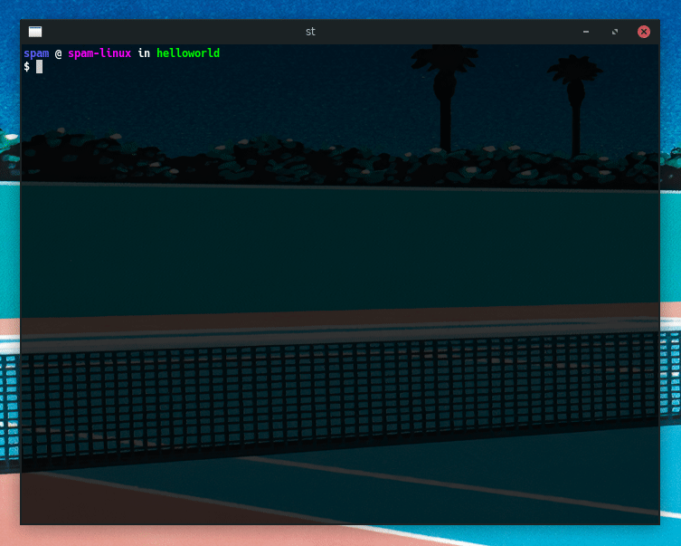

# Compiler

**<u>Compile a Single Source File</u>**


```gcc example.c -o example.run```

Then we could run the executable file by ```./example.run```.

* The filename is considered as the input file of our compiler. It is passed to the compiler without any parameters.
* The parameter `-o` specifies the output executable file name.
* Some other  useful arguments:
    * `-g` Adds debugging symbols for use with [gdb](https://www.gnu.org/software/gdb/).
    * `-Wall` Enables all compiler warning messages.
    * `-pedantic` Compiler enforces the specified C standard pedantically. 
    * `-std=cxx` Specify a version of C/CPP (by replacing the xx) to compile against.

### Example: 


