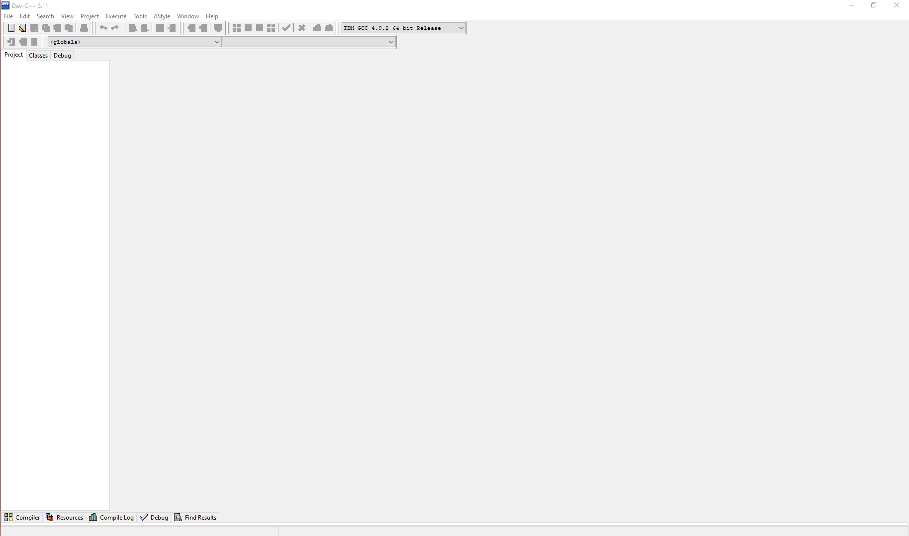
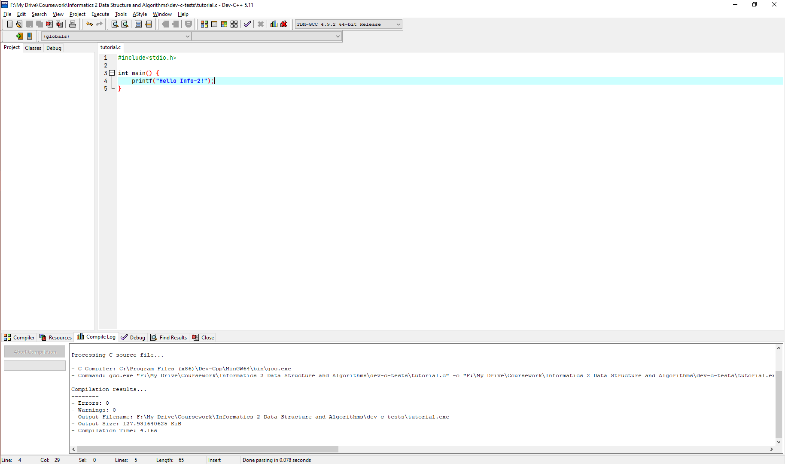
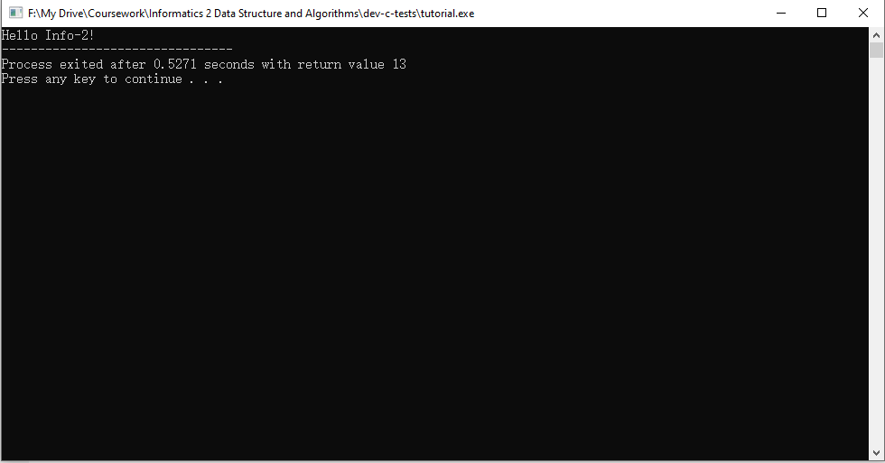

# Installation of C Compiler

Just like in the Info-1 course, you will need a compiler to finish the exercises (and exams) for Info-2, but we need a compiler for ```C``` this time. In this tutorial, we will provide some instructions on how to set up your compiler, and how to use its basic functions.

## Windows Users

### Installation

If you are using Windows, we recommend you to use **Dev-C/C++**, which can be downloaded at [https://sourceforge.net/projects/orwelldevcpp/](https://sourceforge.net/projects/orwelldevcpp/). The installation are listed as below:

* Download the installer. It should be some .exe file with the filename ```Dev-cpp 5.11 TDM-GCC 4.92 setup.exe```.

* Double click the installer, select your preferred language (we recommend you to use **English**, as in future we will demonstrate the process in English version).

* Choose components. Make sure you have tick the ```TDM-GCC 4.92 compiler```, as illustrated below:

  

* Click Next and finish the installation process, as prompted.

* Launch the Dev-C++ from your desktop icon or the menu, and you should be able to see the following window:



* Click the ```File->New->Source File``` button to create a new ```.c``` file, and you can start programming!
* When you write some code, you can save the source file to some folder on your local computer.

### Run Your Program

Now that you've write some code in the new file you created, you can compile and run your program in the Dev-C++ environment. Now assume we have the code below:



You can then press ```F11```, or click the ```Execute->Compile & Run ``` button to compile and run your code. After you do it, you will see a window as below:



If you see the same thing with me, then congratulations, you are good to go!

## Mac OS/Linux Users

If you are using Mac OS or Linux (e.g. Ubuntu, Fedora, etc), then you should already have ```gcc``` installed, which is one of the most popular ```c``` compiler. In order to check this, type ```gcc -v``` in your terminal.

On Mac OS, you should be able to see:


On Linux, you should be able to see:


As long as you are not receiving an ``Unknown Command```, you should be good to go, and you can then use any code editor, e.g. VSCode to edit your code, compile it with gcc and run it in terminal. 

For example, assume we have the same ```C``` code named ```tutorial.c``` that simply prints the ```Hello Info-2!```. Then we can compile and run it with:

``` bash 
gcc tutorial.c -o tutorial // compile
./tutorial // run
```

You should be able to see the following results:


If so, then you are good to go!